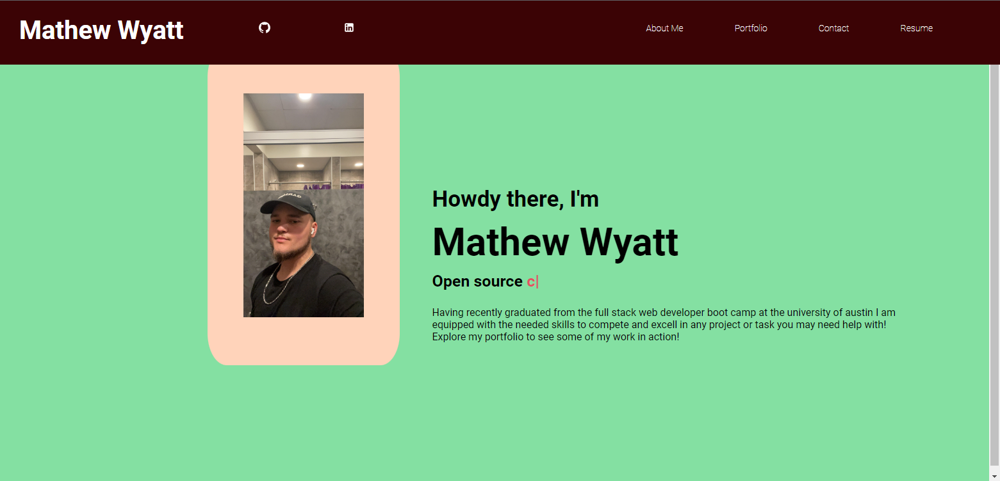
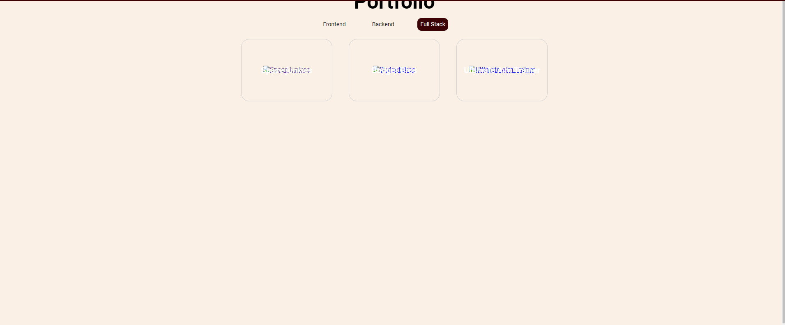
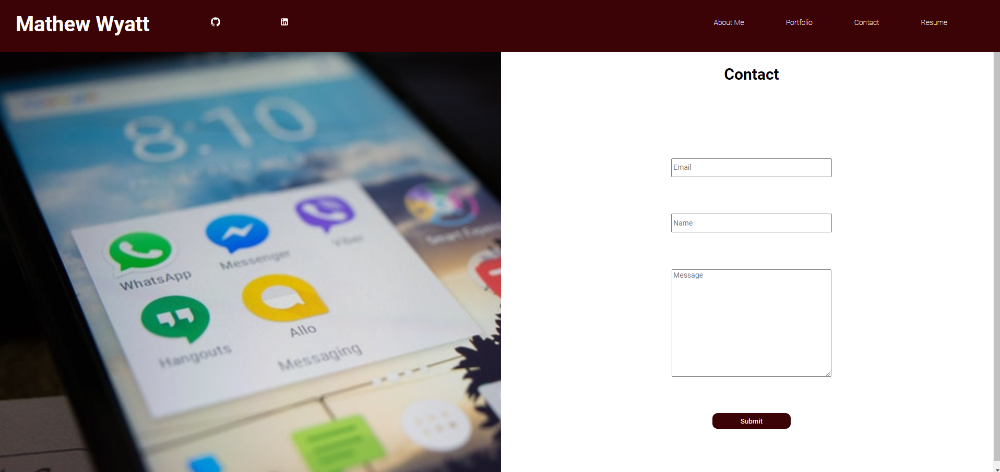
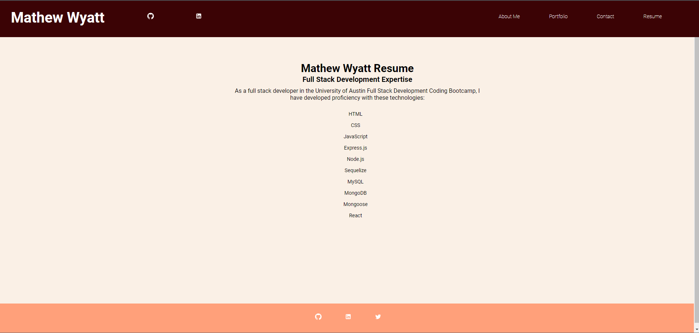

# Portfolio 2.0


## Description


For this project i made a updated and improved version of my 1st portfolio with new technologies and more of my work.






## Table of Contents


- [Installation](#installation)
- [Usage](#usage)
- [License](#license)
- [Questions](#questions)


## Installation


To install necessary dependencies, run the following command:


```
Run "npm i" then "npm start"
```


## Usage


For interested employeers this portfolio will allow them to view my skills and talents. It will also let them see my previously worked on projects.


## License

 [MIT](https://opensource.org/licenses/MIT)


## Questions


If you have any questions about the repo, open an issue or contact me directly at mathewandnana@gmail.com. You can find more of my work at NRDmatt.